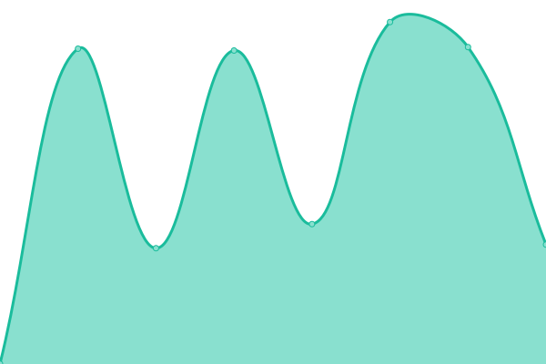

# [📈 Live Status](https://easybits-tech.github.io/upptime): <!--live status--> **🟩 All systems operational**

This repository contains the open-source uptime monitor and status page for [easybits-tech](https://easybits.tech), powered by [Upptime](https://github.com/upptime/upptime).

With [Upptime](https://upptime.js.org), you can get your own unlimited and free uptime monitor and status page, powered entirely by a GitHub repository. We use [Issues](https://github.com/easybits-tech/upptime/issues) as incident reports, [Actions](https://github.com/easybits-tech/upptime/actions) as uptime monitors, and [Pages](https://easybits-tech.github.io/upptime) for the status page.

<!--start: status pages-->
<!-- This summary is generated by Upptime (https://github.com/upptime/upptime) -->
<!-- Do not edit this manually, your changes will be overwritten -->
<!-- prettier-ignore -->
| URL | Status | History | Response Time | Uptime |
| --- | ------ | ------- | ------------- | ------ |
|  [Homepage](https://www.easybits.tech) | 🟩 Up | [homepage.yml](https://github.com/easybits-tech/upptime/commits/HEAD/history/homepage.yml) | 

 429ms
     
 | 

<a href="https://easybits-tech.github.io/upptime/history/homepage">100.00%</a>
    

|  [Admin](https://admin.easybits.tech/) | 🟩 Up | [admin.yml](https://github.com/easybits-tech/upptime/commits/HEAD/history/admin.yml) | 

 521ms
     
 | 

<a href="https://easybits-tech.github.io/upptime/history/admin">100.00%</a>
    

|  [API](https://api.easybits.tech/api/v0/healthcheck/) | 🟩 Up | [api.yml](https://github.com/easybits-tech/upptime/commits/HEAD/history/api.yml) | 

 533ms
     
 | 

<a href="https://easybits-tech.github.io/upptime/history/api">100.00%</a>
    

|  [API Controller](https://api-controller.easybits.tech/health/__ready__) | 🟩 Up | [api-controller.yml](https://github.com/easybits-tech/upptime/commits/HEAD/history/api-controller.yml) | 

 1196ms
     
 | 

<a href="https://easybits-tech.github.io/upptime/history/api-controller">100.00%</a>
    

|  [WS Controller](https://ws-controller.easybits.tech/health/__ready__) | 🟩 Up | [ws-controller.yml](https://github.com/easybits-tech/upptime/commits/HEAD/history/ws-controller.yml) | 

 997ms
     
 | 

<a href="https://easybits-tech.github.io/upptime/history/ws-controller">100.00%</a>
    

|  [TG Controller](https://tg-controller.easybits.tech/health/__ready__) | 🟩 Up | [tg-controller.yml](https://github.com/easybits-tech/upptime/commits/HEAD/history/tg-controller.yml) | 

 980ms
     
 | 

<a href="https://easybits-tech.github.io/upptime/history/tg-controller">100.00%</a>
    

|  [Extractor](https://extractor.easybits.tech/) | 🟩 Up | [extractor-app.yml](https://github.com/easybits-tech/upptime/commits/HEAD/history/extractor-app.yml) | 

 1594ms
     
 | 

<a href="https://easybits-tech.github.io/upptime/history/extractor-app">100.00%</a>
    

|  [Homepage [dev]](https://www.dev.easybits.tech) | 🟩 Up | [homepage-dev.yml](https://github.com/easybits-tech/upptime/commits/HEAD/history/homepage-dev.yml) | 

 470ms
     
 | 

<a href="https://easybits-tech.github.io/upptime/history/homepage-dev">100.00%</a>
    

|  [Admin [dev]](https://admin.dev.easybits.tech/) | 🟩 Up | [admin-dev.yml](https://github.com/easybits-tech/upptime/commits/HEAD/history/admin-dev.yml) | 

 502ms
     
 | 

<a href="https://easybits-tech.github.io/upptime/history/admin-dev">100.00%</a>
    

|  [API [dev]](https://api.dev.easybits.tech/api/v0/healthcheck/) | 🟩 Up | [api-dev.yml](https://github.com/easybits-tech/upptime/commits/HEAD/history/api-dev.yml) | 

 558ms
     
 | 

<a href="https://easybits-tech.github.io/upptime/history/api-dev">100.00%</a>
    

|  [API Controller [dev]](https://api-controller.dev.easybits.tech/health/__ready__) | 🟩 Up | [api-controller-dev.yml](https://github.com/easybits-tech/upptime/commits/HEAD/history/api-controller-dev.yml) | 

 893ms
     
 | 

<a href="https://easybits-tech.github.io/upptime/history/api-controller-dev">100.00%</a>
    

|  [WS Controller [dev]](https://ws-controller.dev.easybits.tech/health/__ready__) | 🟩 Up | [ws-controller-dev.yml](https://github.com/easybits-tech/upptime/commits/HEAD/history/ws-controller-dev.yml) | 

 975ms
     
 | 

<a href="https://easybits-tech.github.io/upptime/history/ws-controller-dev">100.00%</a>
    

|  [TG Controller [dev]](https://tg-controller.dev.easybits.tech/health/__ready__) | 🟩 Up | [tg-controller-dev.yml](https://github.com/easybits-tech/upptime/commits/HEAD/history/tg-controller-dev.yml) | 

 1092ms
     
 | 

<a href="https://easybits-tech.github.io/upptime/history/tg-controller-dev">100.00%</a>
    

|  [Extractor [dev]](https://extractor.dev.easybits.tech/) | 🟩 Up | [extractor-app-dev.yml](https://github.com/easybits-tech/upptime/commits/HEAD/history/extractor-app-dev.yml) | 

 1315ms
     
 | 

<a href="https://easybits-tech.github.io/upptime/history/extractor-app-dev">100.00%</a>
    

<!--end: status pages-->

[**Visit our status website →**](https://easybits-tech.github.io/upptime)

## 📄 License

- Powered by: [Upptime](https://github.com/upptime/upptime)
- Code: [MIT](./LICENSE) © [Anand Chowdhary](https://anandchowdhary.com), supported by [Pabio](https://pabio.com)
- Data in the `./history` directory: [Open Database License](https://opendatacommons.org/licenses/odbl/1-0/)
